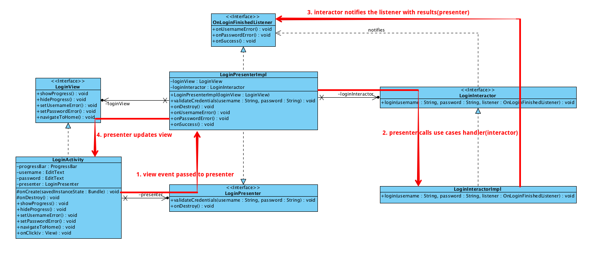

How it Works
==========

1. View(Activity, Fragment, ...) calls presenter methods whenever there're user interaction
2. Presenter implementation calls the interactor(use case handler) to get results from business/domain layer
3. Interactor implementation returns the results or just returns the control to presenter implementation by calling listener methods
4. Presenter implementation calls view methods to update the UI by calling view interface.

View, Presenter, Interactor and Listener interfaces are used to remove tight coupling.

View becomes too humble to test. We can use fake(simulator) presenter to test view.

Presenter and Interactor can be tested.
